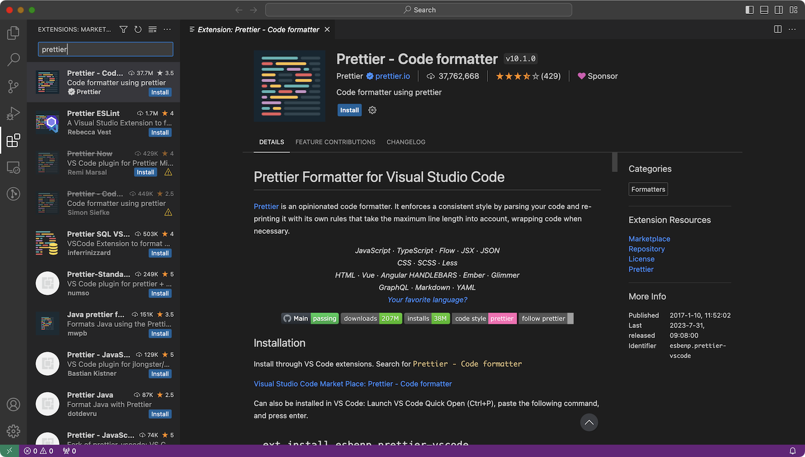
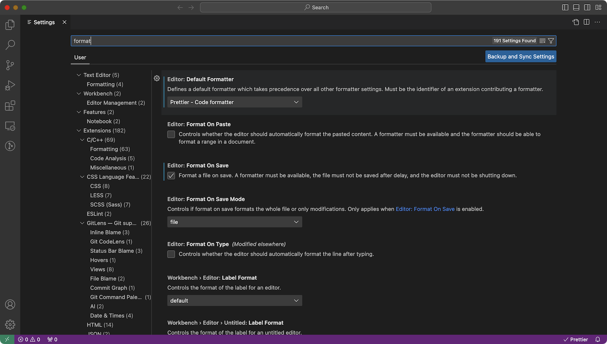

# 0.0. Install software

This section contains instructions for installing all the software required to complete this guide. You'll use most, if not all, of them to work on actual TSE projects too. If you already have something installed, just make sure it's a recent version.

## Windows users only: WSL (optional)

[Windows Subsystem for Linux](https://learn.microsoft.com/en-us/windows/wsl/install) (WSL) is a way to use Linux applications and tools directly on Windows. We've found that it's not necessary for our use case in TSE, as the Windows versions of our required software usually works well. But if you'd like to experiment with WSL, then feel free!

## VS Code or an alternative

We need an integrated development environment (IDE) or text editor to write code. TSE recommends [Visual Studio Code](https://code.visualstudio.com) due to its industry prevalence, ease of use, and many useful extensions. You're free to use whatever you'd like, but the rest of this guide will assume that you're using VS Code.

Follow the steps below to install VS Code:

1. Download VS Code for your operating system from the [VS Code downloads page](https://code.visualstudio.com/download).
2. Follow the installer instructions.

## Prettier and ESLint extensions

No matter what editor you choose, we **strongly** recommend that you also install the corresponding Prettier and ESLint extensions (and your engineering manager may require you to do so). We use Prettier to automatically format JavaScript/TypeScript code (such as fixing indentation) so it's more consistent and easier to read, and we use ESLint to make sure the code follows certain rules so it's more likely to work correctly.

Follow the steps below to install and configure the [Prettier extension for VS Code](https://marketplace.visualstudio.com/items?itemName=esbenp.prettier-vscode):

1. Navigate to the Extensions tab in the left sidebar.
2. Enter "Prettier" in the search bar and select the extension published by prettier.io.
   
3. Click Install.
4. Now we have Prettier added to VS Code, but we still must configure it to auto-format files. Navigate to Settings.
   1. Click the gear icon at the bottom of the left sidebar, then select Settings.
   2. Alternatively, press `Cmd+,` or go to Code > Settings > Settings on Mac, or go to File > Preferences > Settings on Windows.
5. Enter "format" in the search bar. Under "Editor: Default Formatter," select "Prettier - Code formatter."
6. Finally, find the "Editor: Format On Save" option and make sure it's checked.
   

Similarly, install the [ESLint extension](https://marketplace.visualstudio.com/items?itemName=dbaeumer.vscode-eslint) published by Microsoft as well. This extension doesn't require any additional configuration.

## Git

1. Check your Git version by entering `git --version` in your command prompt.
2. You should have version 2.x (2.30+ recommended). If not, then install the latest version from the [Git downloads page](https://git-scm.com/downloads).

## Node

1. Check your Node version by running `node --version`.
2. You should have version 18.x or above. If not, then install the latest LTS (long-term support) version from the [Node downloads page](https://nodejs.org/en/download).

## MongoDB

1. Check your MongoDB version by running `mongod --version`.
2. You should have version 5.x or above. If not, then install the latest Community Edition version by following the [MongoDB installation guide](https://www.mongodb.com/docs/manual/installation/#mongodb-installation-tutorials) for your operating system. (You can also follow this [alternative MongoDB setup guide](https://www.prisma.io/dataguide/mongodb/setting-up-a-local-mongodb-database) if the official one is confusing.)
3. Also follow the instructions to start MongoDB on your computer. Run it as a service if possible.

## Other software (optional)

Here are some other tools and extensions which you might find helpful. None are required for the purposes of this todo app, though.

- [Postman](https://www.postman.com/downloads/): Useful for manually testing backend routes before there's a frontend implementation. Alternatively, for simple requests you can also use the `curl` command.
- [GitLens VS Code extension](https://marketplace.visualstudio.com/items?itemName=eamodio.gitlens): Useful for checking who last edited any particular line of code; also provides some additional UI integration for Git, such as viewing the differences in a file between previous commits.
- [React Developer Tools browser extension](https://react.dev/learn/react-developer-tools): Useful for analyzing your React frontend component structure, such as finding out what component is rendering a particular HTML element.

| Previous                           | Up           | Next                                         |
| ---------------------------------- | ------------ | -------------------------------------------- |
| [Introduction](../Introduction.md) | [Part 0](./) | [Part 0.1. Set up accounts](./0-1-Set-up.md) |
