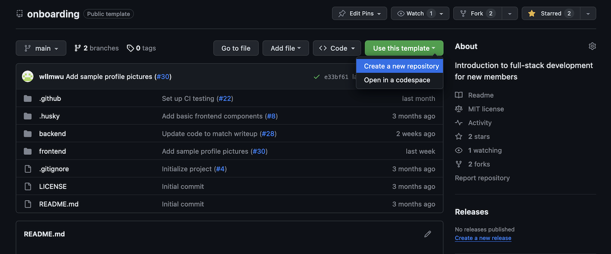
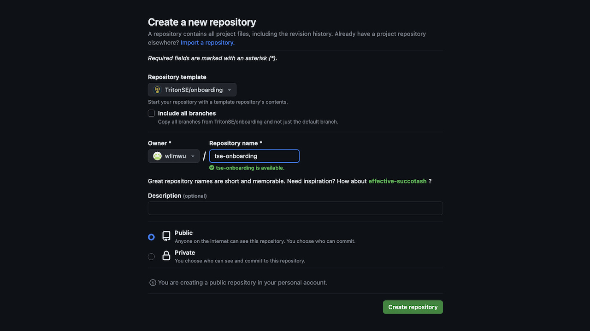
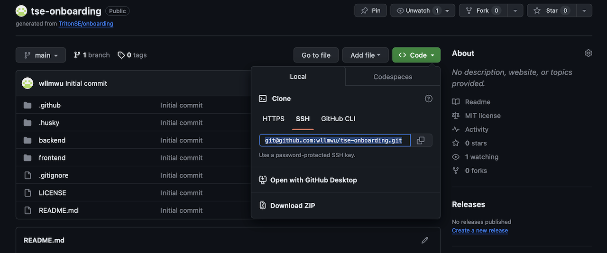

# 0.2. Clone and run the project

## Create a new repository from this template

With everything installed, we now want to get a copy of the project onto your computer so you can start working on it. This repository is a "[template repository](https://docs.github.com/en/repositories/creating-and-managing-repositories/creating-a-repository-from-a-template#about-repository-templates)," a GitHub feature that allows you to duplicate all the files into your own new repo.

1. Make sure you're signed into GitHub with the account that you'll use for TSE work. (You should have provided your username to us already.)
2. On the [main page of this repo](https://github.com/TritonSE/onboarding), click the green "Use this template" button and select "Create a new repository."
   
3. Give the new repo a name if you want to (such as "tse-onboarding"), and make sure it will be created under your personal account. You can set it to public or private; other options can be left as the default. Then click "Create repository from template."
   
4. Open your new repo in GitHub if it's not already open.
5. Click the green Code dropdown in the upper right corner, then copy the URL under the SSH tab. (Make sure this is your fork, not the original repo!)
   
6. Open your command prompt and navigate to the folder you'd like to store the project in.

   ```shell
   cd <path to folder>
   ```

   <details>
   <summary><strong>❓ Hint: Command examples</strong></summary>

   _In command examples, you should replace the text within `<angle brackets>` (including the brackets) with your own data._
   </details>

7. Clone your forked repo (paste the SSH URL that you copied earlier).
   ```shell
   git clone <repository URL>
   ```

You should now have a copy of all the starter code in the folder you selected.

## Run the project

We're almost ready to run the project for the first time! Before we can do that, we just need to add some environment variables required by the code.

1. Open the repo in VS Code (File > Open Folder, then select the root folder of the repo). In the `backend` folder, create a new file named `.env`.
2. Paste the following into the `.env` file:
   ```
   PORT=3001
   MONGODB_URI="mongodb://127.0.0.1:27017/todoList"
   FRONTEND_ORIGIN="http://localhost:5173"
   ```
3. Create another `.env` in the `frontend` folder:
   ```
   VITE_API_BASE_URL="http://localhost:3001"
   ```

<details>
<summary><strong>ℹ️ Definition: Environment variable</strong></summary>

<em>

An **environment variable** is a value stored in the shell environment which a program can access while it's running. Like variables in code, they have a name (such as "PORT") and a value (such as "3001"). They are often used to store information like:

- Values which change depending on whether the program is running in development or production mode (for example, 127.0.0.1 in the MONGODB_URI represents your own computer; when the backend is running on a real server, we might change that to a real IP address)
- Sensitive data that should not be stored in Git (such as secret API keys and passwords)

</em>
</details>

<details>
<summary><strong>ℹ️ Definition: .env file</strong></summary>

_`.env` files are a standard way to provide environment variables to a program. They are usually included in a repo's [`.gitignore` file](/.gitignore) so Git doesn't track it, especially if they contain development secrets. The `dotenv` package automatically pulls values from a `.env` file into the shell environment when we run our project._

</details>

**Note:** In a Vite project like our frontend, all variable names in a `.env` file should [start with `VITE_`](https://vitejs.dev/guide/env-and-mode.html#env-files).

Finally, we can run our application! Follow the steps below to run both the frontend and backend. If you'd like to know more about some of the commands, see the next section. If anything fails and you can't figure out why, ping us in the **#onboarding** Slack channel.

1. Make sure MongoDB is running on your computer (see [Part 0.0](./0-0-Install.md)). You can leave it running after you're done working, or stop it and restart it when you come back.
2. Navigate to the backend folder and install packages.
   ```shell
   cd backend
   npm install
   ```
3. Once that's complete (you can ignore any warnings about security vulnerabilities), start the backend. This will automatically create a local MongoDB database for us to use.
   ```shell
   npm start
   ```
4. In another instance of the command prompt (new tab or window), start the frontend.
   ```shell
   cd frontend
   npm install
   npm run dev
   ```

If the backend is running correctly, you should see output like the following in your command prompt:

```
> backend@1.0.0 start
> nodemon src/server.ts

[nodemon] 3.0.1
[nodemon] to restart at any time, enter `rs`
[nodemon] watching path(s): *.*
[nodemon] watching extensions: ts,json
[nodemon] starting `ts-node src/server.ts`
Mongoose connected!
Server running on 3001.
```

And if the frontend is running correctly, you should see output like the following:

```
  VITE v5.2.8  ready in 498 ms

  ➜  Local:   http://localhost:5173/
  ➜  Network: use --host to expose
  ➜  press h + enter to show help
```

In your Internet browser, visit http://localhost:5173 and you should see the Home page of our todo app.

<details>
<summary><strong>🤔 For new developers: Running npm install</strong></summary>

_You only need to run `npm install` the first time you set up a project and any time the packages change (for example, when you or someone else on your team adds a new package)._

</details>

Lastly, we need to check that the frontend and backend can communicate with each other. In the starter code, we've implemented task creation for you already. Follow the steps below to create some Task objects in your database and verify that things are working.

1. Open a new command prompt instance and enter `mongosh`. You should see the MongoDB interactive shell, with a different prompt before your cursor.
2. Enter `show dbs` to show a list of databases on your local computer. You should see one called `todoList`.
3. Enter `use todoList` to switch to the `todoList` database. The shell prompt should now look like `todoList>`.
4. Make sure your frontend and backend are still running.
5. In your browser, type some text in the "New task" form's Title and Description fields, then click Save.
6. Back in mongosh, enter `db.tasks.find()` to find all documents in the `tasks` collection. You should see an object with the title and description that you sent in the form.
7. Submit the "New task" form a few more times with different inputs (try some things like empty description, empty title, super long description, etc.).
8. In mongosh, enter `db.tasks.find()` again and check that all the valid tasks (those with nonempty titles) were saved.
9. To close mongosh, enter `quit()`.

| Previous                                | Up           | Next                                                  |
| --------------------------------------- | ------------ | ----------------------------------------------------- |
| [0.1. Set up accounts](./0-1-Set-up.md) | [Part 0](./) | [0.3. Explore the designs and code](./0-3-Explore.md) |
